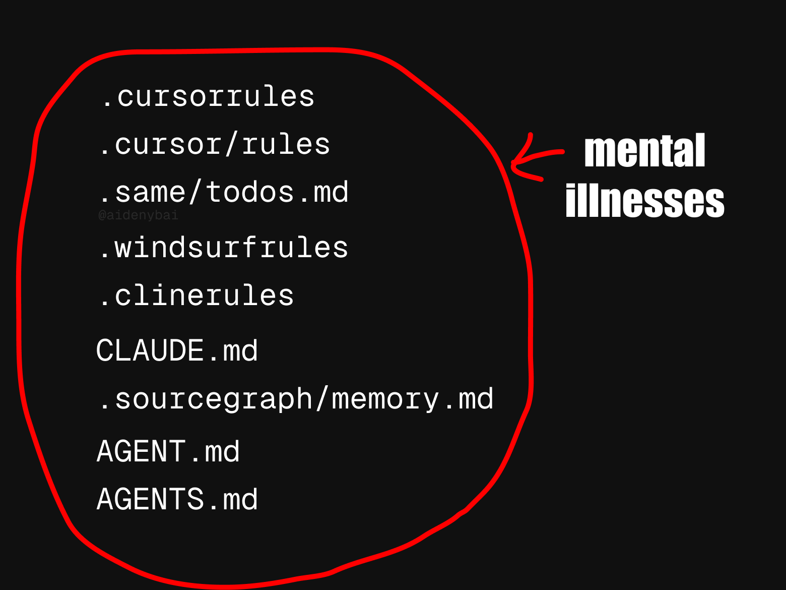

# Unified .rules File Convention

This document outlines the convention for the unified `.rules` file, a single file designed to store all your AI assistant/editor rules for a project in a centralized and portable manner.

## Purpose

The `.rules` file aims to:

1.  **Simplify Rule Management**: Instead of scattering rules across various editor-specific files (e.g., `.cursor/rules/`, `.windsurfrules`, `CLAUDE.md`), you can keep them all in one place.
2.  **Improve Portability**: Easily share and version control your project-specific rules along with your codebase.
3.  **Standardize Format**: Provide a consistent way to define rules, including common metadata.

### The Challenge: Rule File Proliferation

Many development tools and AI assistants rely on specific configuration files for custom instructions or rules. While this allows for tailored behavior, it can lead to a multitude of rule files scattered across a project or system, each with its own format. This is the problem the `unified` provider and the `.rules` convention aim to simplify.


_Image concept from a [tweet by @aidenybai](https://x.com/aidenybai/status/1923781810820968857/photo/1), illustrating the proliferation of rule files._

## File Location

The `.rules` file should be located in the root directory of your project.

```
my-project/
├── .rules       <-- Your unified rules file
├── src/
└── package.json
```

## File Format

The `.rules` file uses an XML-like tagged format to define individual rules. Each rule is enclosed in a tag named after the rule itself. This format is human-readable and easy to parse.

### Structure of a Rule Block

```xml
<your-rule-name>
  <!-- Optional: Human-readable metadata -->
  <!-- Description: A brief explanation of what the rule does. -->
  <!-- AlwaysApply: true/false (Cursor-specific, can be included for compatibility) -->
  <!-- Globs: pattern1,pattern2 (Cursor-specific, can be included for compatibility) -->

  Your actual rule content goes here.
  This can be multi-line plain text, a prompt, or any specific syntax required by the target AI model or tool.

</your-rule-name>
```

**Explanation:**

- **`<your-rule-name>`**: This is the opening tag for the rule. The name should be unique within the `.rules` file and is used to identify the rule (e.g., by the `vibe-rules load unified <your-rule-name>` command).
- **Metadata Comments (Optional)**:
  - `<!-- Description: ... -->`: A description of the rule.
  - `<!-- AlwaysApply: true/false -->`: Corresponds to Cursor's `alwaysApply` metadata. Useful if you intend to use these rules with Cursor or a system that understands this flag.
  - `<!-- Globs: pattern1,pattern2 -->`: Corresponds to Cursor's `globs` metadata. Specify comma-separated glob patterns.
- **Rule Content**: The actual text or prompt for the rule.
- **`</your-rule-name>`**: The closing tag for the rule.

### Example `.rules` File

```xml
<explain-code-snippet>
  <!-- Description: Explains the selected code snippet. -->
  Explain the following code snippet:
```

{{code}}

```
</explain-code-snippet>

<generate-test-cases>
<!-- Description: Generates test cases for the given function. -->
<!-- Globs: *.test.js,*.spec.ts -->
Given the following function, please generate a comprehensive set of unit test cases in Jest format:
```

{{code}}

```
</generate-test-cases>

<my-custom-task-for-pkg>
This is a rule installed from 'my-package'.
It helps with a specific task related to this package.
</my-custom-task-for-pkg>
```

## Using with `vibe-rules`

### Saving Rules

You can save rules to your local common store and then load them into the `.rules` file, or install them directly from packages.

1.  **Save a rule to the local store (optional first step):**

    ```bash
    vibe-rules save my-new-rule -c "This is the content of my new rule."
    ```

2.  **Load a rule into the project's `.rules` file:**
    ```bash
    vibe-rules load unified my-new-rule
    # This will create/update .rules in the current directory with the 'my-new-rule' block.
    ```

### Installing Rules from Packages

When you install rules from an NPM package using the `unified` editor type, `vibe-rules` will add them to your project's `.rules` file. Rule names will be prefixed with the package name.

```bash
# Install rules from 'some-npm-package' into .rules
vibe-rules install unified some-npm-package

# Install rules from all dependencies into .rules
vibe-rules install unified
```

This would result in entries like `<some-npm-package-rulename>...</some-npm-package-rulename>` in your `.rules` file.

### Listing Rules

To see rules specifically defined for the unified provider in your local store:

```bash
vibe-rules list --type unified
```

(Note: `list` command currently lists from the global store, not directly from a project's `.rules` file. To see rules in a project, open the `.rules` file.)

## Benefits of the `.rules` Convention

- **Centralization**: All project-specific AI prompts and rules in one predictable location.
- **Version Control**: Easily track changes to your rules alongside your code.
- **Collaboration**: Share rule configurations seamlessly with your team.
- **Editor Agnostic (Conceptual)**: While `vibe-rules` helps manage this file, the raw `.rules` file can be understood or parsed by other tools or future IDE integrations that adopt this convention.

## Future Considerations

- **Global `.rules`**: Support for a global `~/.rules` file for user-wide rules.
- **Enhanced Tooling**: IDE extensions or features that directly consume and suggest rules from the `.rules` file.
